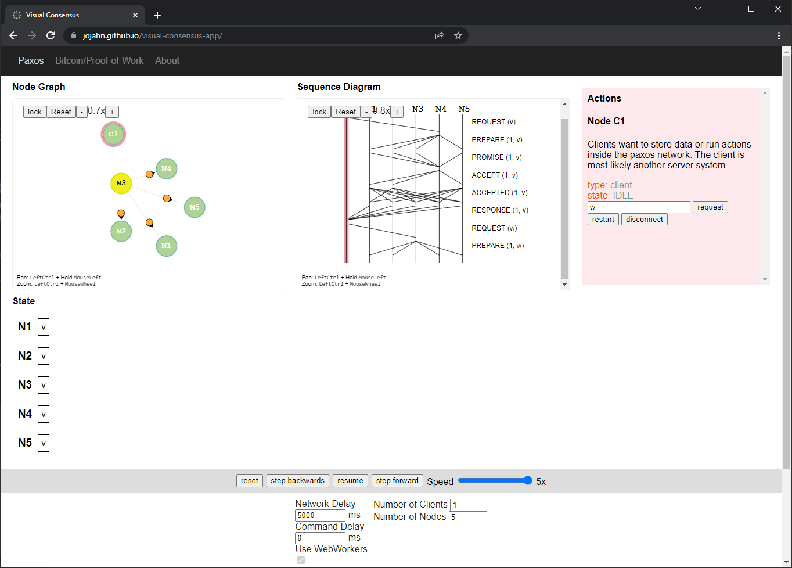
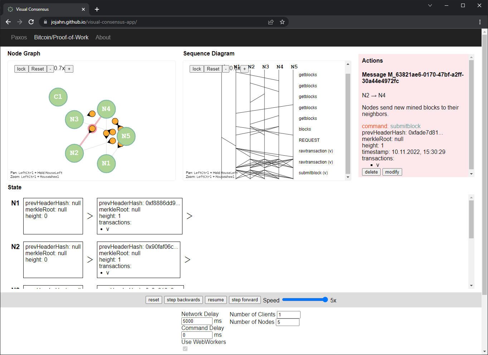

# Visual Consensus  

[](https://github.com/jojahn/visual-consensus-app/releases) [](/LICENSE) [](https://github.com/jojahn/visual-consensus-app/deployments/activity_log?environment=github-pages)


> visualization of consensus algorithmus in distributed systems  
> *Vite, TypeScript, Svelte*
 


---

Visit on [jojahn.github.io/visual-consensus-app](https://jojahn.github.io/visual-consensus-app/)

## Project Structure

```bash
├───algorithms
│    ├───paxos
│    └───pow # Proof-of-Work
├───lib # UI Components
├───drawing # Canvas2D Drawing
├───utils # Hashing, etc.
├───simulation # Simulation control and multithreading
├───docs # the built website for github pages
└───public # static website assets
```

## Screenshots

### Paxos Example



### Bitcoin/Proof-of-Work Example



## Self-hosted

1. Download release from [https://github.com/jojahn/visual-consensus-app/releases](https://github.com/jojahn/visual-consensus-app/releases)
2. Unzip downloaded folder
3. Serve assets (e.g. python http server)
    ```bash
    python -m http.server
    ```

## Setup

* Install NodeJS ([https://nodejs.org/en/](https://nodejs.org/en/))
* Install dependencies
    ```bash
    npm install
    ```

### Development

* Start Development Server
    ```bash
    npm run start
    ```
* Visit [http://localhost:3000](http://localhost:3000)
* Develop (*[How to add new algorithms!](DOCS.md#Adding%20a%20new%20algorithm)*)

### Build

* Build the application
    ```bash
    npm run build
    ```
    *The build files are located in `./docs`*
* Preview the build
    ```bash
    npm run preview
    ```

### Test

```bash
npm run test
```

*Tests are written with Jest*
